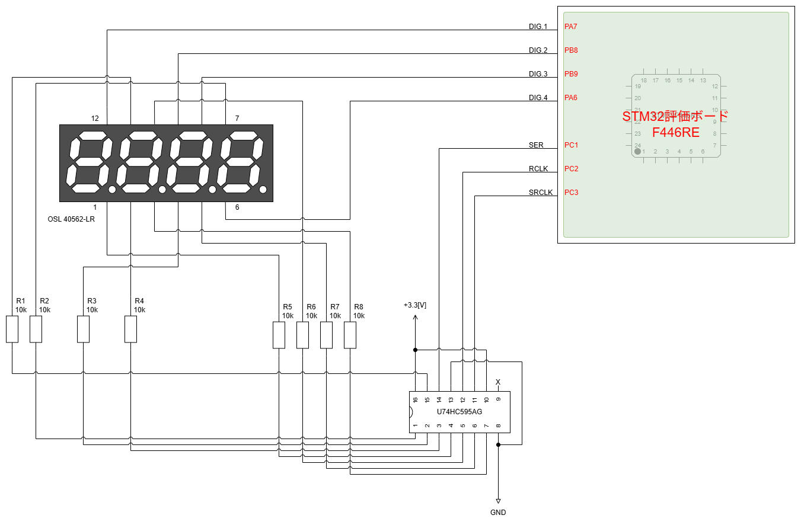
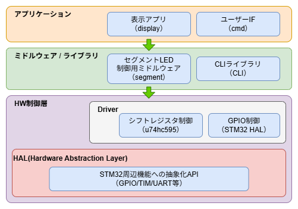

# 7セグメントLEDのダイナミック点灯制御


## 目次
1. [概要](#概要)
2. [環境](#環境)
3. [ソフトウェア構成](#ソフトウェア構成)
4. [参考](#参考)


## 概要
「segment-middleware」モジュールを使用したDEMOプロジェクトです。  
STM32の評価ボードと「segment-middleware」モジュールを使用し、
4桁の7セグメントLEDをダイナミック点灯方式で制御した場合の実現方法について説明します。  


### システム構成
開発用PCからコマンドライン(Tera Termを使用)に7セグメントLEDの制御用コマンドを入力することで、  
コントローラ(STM32評価ボード)を介して7セグメントLEDの表示状態の制御を行うことができます。  


## 環境
DEMOプロジェクトのサンプルコードは、STM32の評価ボードを使用して動作確認を行っています。  


### 開発環境

| Name          | brief                     | Note             |
|---------------|---------------------------|------------------|
| NUCLEO-F446RE | STM32F446RE搭載の評価ボード | -               |
| STM32CubeIDE  | 統合開発環境(IDE)           | ver.2.1.0       |
| STM32CubeMX   | 初期化コード自動生成ツール   | -               |
| OS            | Windows 11                | -                |
| Tera Term     | ターミナルソフト            | baudrate:115200 |


### 回路構成
DEMOでは「ダイナミック接続対応の4桁7セグメントLED」と、「8bitのパラレル出力対応のシフトレジスタ」を使用した回路構成としています。  




セグメントLEDやシフトレジスタは秋月電子通商等で入手が可能です。  

参考  
[ダイナミック接続対応の4桁7セグメントLED][URL1]  
[8ビットシフトレジスター][URL2]  

[URL1]: https://akizukidenshi.com/catalog/g/g103673/
[URL2]: https://akizukidenshi.com/catalog/g/g114053/


### ペリフェラル
各ペリフェラルの設定にはSTM32CubeMXを使用して、初期化コードの生成を行っています。  
設定内容はDEMOプロジェクト配下の.iocを
起動し設定内容をご参照ください。  


## ソフトウェア構成
DEMOプロジェクトのソフトウェア構成図を以下に記載します。  




## 参考
### コマンド一覧
以下に、入力可能な7セグメントLEDの制御用コマンドを記載します。  

```shell
# LEDに数値を設定
# 以下は、LEDに1234を表示する例
seg set 1234

# 以下は、LEDに30.0を表示する例
seg set 30.0

# 点滅ON 500[ms]で点滅する例
seg blink on 500

# 点滅OFF
seg blink off

# 表示クリア
seg clr

# "seg" → "segment"でも同様の動作が可能
segment set 1234
```


### 動作例


